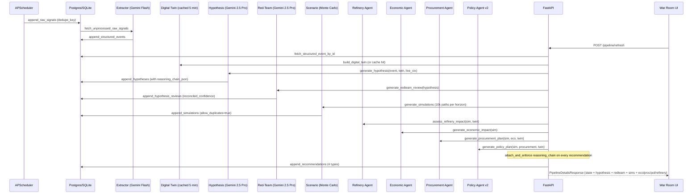

# KAVACH — Detailed Project Report

Date: 2026-07-19
Repository: `ET_Hormuz`
Runtime: Python 3.11 (venv), FastAPI, SQLite (dev) / Postgres (prod), vanilla JS + MapLibre + deck.gl (frontend)

This report describes what actually exists in this repository as of the current commit. It is grounded in the source tree, the three PRDs ([KAVACH_PRD.md](KAVACH_PRD.md), [prd_v2_upgrades.md](prd_v2_upgrades.md), [prd_v3.md](prd_v3.md), [prd_v4.md](prd_v4.md)), the Alembic migrations, tests, and the code under `api/`, `agents/`, `digital_twin/`, `ingestion/`, `orchestration/`, `processing/`, and `frontend/`.

---

## 1. Executive Summary

KAVACH is a decision-support system for India's crude oil supply chain that turns raw geopolitical/market/shipping signals into explainable, ranked operational recommendations (procurement, SPR drawdown/refill, refinery impact) with predicted-vs-actual validation.

It is layered strictly per the PRDs:

- Layer 0: API/data source identification (probe scripts, sample payloads)
- Layer 1: Ingestion (connectors + APScheduler)
- Layer 2: Storage (SQLAlchemy models, Alembic migrations)
- Layer 2.5: Digital Twin (world-model consumed by every agent — PRD v2 U1)
- Layer 3: Extraction (Gemini Flash + deterministic fallback)
- Layer 4: Agents (Hypothesis, Red-Team, Scenario, Refinery, Economic, Procurement, Policy, plus first-class Reasoning Chain and What-if Engine)
- Layer 5: Orchestration (`orchestration/graph.py`)
- Layer 6: API (FastAPI, WebSocket)
- Layer 7: Frontend (KAVACH War Room)
- Layer 8: Hardening (in-memory twin cache, per-run seed jitter, request timeouts, tests)

Core philosophy (from PRDs, enforced by code):
1. Decision-first UX: every screen answers one executive question before showing evidence (PRD v3).
2. Every recommendation must carry a reasoning chain (PRD v2 U2 — enforced by `attach_and_enforce`).
3. Every SPR policy must specify WHEN, HOW MUCH, FROM WHOM, AT WHAT PRICE (PRD v2 U3).
4. What-if runs branch the twin; live state is never mutated (PRD v2 U4).
5. Progressive disclosure — analyst detail is one click away, never on by default.

---

## 2. Architecture Diagram

```mermaid
flowchart TB
  subgraph L0["Layer 0/1 · Ingestion"]
    direction TB
    C1[GDELT]:::src
    C2[NewsAPI]:::src
    C3[Guardian]:::src
    C4[OpenSanctions]:::src
    C5[ACLED]:::src
    C6[ReliefWeb]:::src
    C7[Alpha Vantage · Brent/WTI]:::src
    C8[EIA · petroleum stocks]:::src
    C9[FRED · macro]:::src
    C10[AIS Stream · vessels]:::src
    C11[Stormglass · marine wx]:::src
    C12[OpenWeather · ports]:::src
    SCH[APScheduler<br/>ingestion/scheduler.py]:::proc
    C1 & C2 & C3 & C4 & C5 & C6 & C7 & C8 & C9 & C10 --> SCH
  end

  subgraph L2["Layer 2 · Storage"]
    direction TB
    RS[(raw_signals)]
    SE[(structured_events)]
    HY[(hypotheses)]
    RV[(hypothesis_reviews)]
    SIM[(simulations)]
    REC[(recommendations)]
  end

  SCH --> RS

  subgraph L3["Layer 3 · Extraction"]
    GEX[Gemini Flash extractor<br/>processing/extraction/gemini_extractor.py]
    DEX[Deterministic extractor<br/>processing/extraction/deterministic_extractor.py]
  end
  RS --> GEX & DEX --> SE

  subgraph L25["Layer 2.5 · Digital Twin"]
    direction TB
    SEED[seed_data · countries/ports/routes/refineries/SPR/grades]
    SQLP[SqlPriceProvider]
    SANP[SqlSanctionsProvider]
    TRDP[SqlTradeFlowProvider]
    LIVE[Live enrichers<br/>Alpha Vantage / Stormglass / OpenWeather]
    BLD[builder.build_digital_twin]
    TWIN[(DigitalTwinState)]
    SEED --> BLD
    SQLP --> BLD
    SANP --> BLD
    TRDP --> BLD
    LIVE --> BLD
    BLD --> TWIN
    C11 --> LIVE
    C12 --> LIVE
  end
  RS -.reads.-> SQLP & SANP & TRDP

  subgraph L4["Layer 4 · Agents"]
    direction TB
    HYP[Hypothesis Agent<br/>Gemini 2.5 Pro + deterministic]
    RCH[Reasoning Chain<br/>agents/reasoning_chain.py]
    RED[Red-Team Agent<br/>Gemini 2.5 Pro + deterministic]
    SCN[Scenario Agent<br/>NumPy Monte Carlo · 10k paths]
    REF[Refinery Agent]
    ECO[Economic Agent]
    PRO[Procurement Agent<br/>constraint checklist scoring]
    POL[Policy Agent v2<br/>drawdown + refill]
    WIF[What-if Engine<br/>twin branching]
    HYP --> RCH
    HYP --> RED
    HYP --> SCN
    SCN --> REF & ECO
    ECO --> PRO
    PRO --> POL
    TWIN --> HYP & RED & SCN & REF & PRO & POL & WIF
    SE --> HYP
  end

  subgraph L5["Layer 5 · Orchestration"]
    GRA[orchestration/graph.py<br/>PipelineState · cached twin · seed jitter]
  end
  HYP & RED & SCN & REF & ECO & PRO & POL --> GRA
  GRA --> HY & RV & SIM & REC

  subgraph L6["Layer 6 · API · FastAPI"]
    R1[/signals]
    R2[/pipeline]
    R3[/whatif]
    R4[/backtest]
    R5[/kg]
    R6[/digital-twin]
    WS[/ws/live · WebSocket/]
  end
  REC --> R2 & R3 & R4
  TWIN --> R6
  SE --> R1 & R5
  WIF --> R3

  subgraph L7["Layer 7 · War Room UI"]
    UI[frontend/index.html · app.js · styles.css<br/>MapLibre + deck.gl overlays]
  end
  R1 & R2 & R3 & R4 & R5 & R6 & WS --> UI

  classDef src fill:#0b3d91,stroke:#8ab6ff,color:#eaf2ff
  classDef proc fill:#132743,stroke:#4fa3ff,color:#dfe9ff
```

---

## 3. Data Flow (single pipeline run)



---

## 4. Layer-by-Layer Detail

### 4.1 Layer 0 — API & Data Source Identification

- Probe script: [scripts/probe_sources.py](scripts/probe_sources.py) dumps raw JSON per source to `data/samples/`.
- Sample payloads used as offline fixtures for parse tests in [tests/test_connectors_parse.py](tests/test_connectors_parse.py) and for scheduler `--mode sample`.

### 4.2 Layer 1 — Ingestion

- Canonical schema: [ingestion/schemas/raw_signal.py](ingestion/schemas/raw_signal.py) `RawSignal`.
- Connectors under [ingestion/connectors/](ingestion/connectors/), each a pure `fetch()` returning `list[RawSignal]`:
  - `gdelt.py`, `newsapi.py`, `guardian.py`
  - `sanctions.py` (OpenSanctions)
  - `acled.py`, `reliefweb.py`
  - `alpha_vantage.py` (Brent + WTI), `eia.py`, `fred.py`
  - `ais_stream.py` (websocket, bounding-box)
  - `prices.py`, `comtrade.py`
  - `_session.py` — shared `requests` session with timeouts/retries used by all HTTP calls
- Scheduler: [ingestion/scheduler.py](ingestion/scheduler.py) — `BlockingScheduler` (UTC). Live cadences:
  - GDELT/NewsAPI: 15 min
  - Guardian: 30 min
  - ACLED/ReliefWeb: 1 h
  - Sanctions: 1 day
  - AIS Stream: 20 min
  - Alpha Vantage: 6 h
  - EIA/FRED: 12 h
- Modes: `--mode live | sample`, `--run-once` for CI/smoke tests.

### 4.3 Layer 2 — Storage

- ORM in [ingestion/storage.py](ingestion/storage.py) (SQLAlchemy 2.x `DeclarativeBase`), tables:
  - `raw_signals` (unique `dedupe_key`)
  - `structured_events`
  - `hypotheses` (with `reasoning_chain` and `reasoning_chain_json`)
  - `hypothesis_reviews`
  - `simulations`
  - `recommendations`
- Alembic migrations under [alembic/versions/](alembic/versions/):
  - `20260710_0001_initial_layer2_tables.py`
  - `20260710_0002_raw_signals_dedupe_key.py`
  - `20260710_0003_dedupe_key_sourceid_first.py`
  - `20260710_0004_hypothesis_reviews.py`
  - `20260715_0005_hypothesis_causal_chain.py`
- Dedupe: `make_dedupe_key` prefers `source + source_id`, otherwise hashes payload.
- Fetch helpers per table (`fetch_unprocessed_*`, `fetch_recommendations_by_type`, `fetch_recommendation_map_by_simulation`, etc.).
- Dev DB: `kavach.db` (SQLite); prod path via `DATABASE_URL`.

### 4.4 Layer 2.5 — Digital Twin (PRD v2 Upgrade 1)

Directory: [digital_twin/](digital_twin/)

- Canonical Pydantic model `DigitalTwinState` in [digital_twin/graph_state.py](digital_twin/graph_state.py) with entities:
  - `Country`, `Port`, `Chokepoint`, `Route`, `Tanker`, `CrudeGrade`, `Refinery`, `SPRSite`, `SanctionEntry`, `PricePoint`, `SupplierCapacity`, `TradeFlow`, `ProvenanceEntry`.
- Seed topology: [digital_twin/seed_data.py](digital_twin/seed_data.py) — countries, chokepoints (Hormuz, Bab-el-Mandeb, Suez, Malacca), Indian ports/refineries (with real lat/lon for all 8), crude grades, SPR sites, baseline supplier capacities.
- Providers: [digital_twin/providers.py](digital_twin/providers.py) — SQL-backed `SqlPriceProvider`, `SqlSanctionsProvider`, `SqlTradeFlowProvider`, `SqlTankerProvider`.
- Live enrichers: [digital_twin/providers_live.py](digital_twin/providers_live.py) — `AlphaVantagePriceProvider` (composed with SQL prices via `CompositePriceProvider`), `StormglassChokepointEnricher` (raises `chokepoint.risk_score` from wind/wave/visibility), `OpenWeatherPortEnricher` (raises `port.congestion_pct`). All fail-safe; auto-wire only when the corresponding env keys are set.
- Builder: [digital_twin/builder.py](digital_twin/builder.py) — `build_digital_twin(database_url, enable_live_enrichers=True)` returns a `DigitalTwinState` with full `provenance` list. `refresh_digital_twin` updates dynamic slices in place.
- Branching: [digital_twin/simulation_state.py](digital_twin/simulation_state.py) — `branch_for_scenario(twin, overrides)` deep-copies via `model_copy(deep=True)` and applies `ScenarioOverrides` (chokepoint status, port status, refinery status, supplier capacity deltas, prices, demand). Live state is guaranteed immutable.

### 4.5 Layer 3 — Extraction

- Gemini Flash: [processing/extraction/gemini_extractor.py](processing/extraction/gemini_extractor.py) — strict JSON output prompt; `parse_gemini_json_text` tolerates fences.
- Deterministic fallback: [processing/extraction/deterministic_extractor.py](processing/extraction/deterministic_extractor.py) — classifies signal text into `{actors, action_type, target, confidence}` without an LLM (used in tests and offline).

### 4.6 Layer 4 — Agents

All agents live in [agents/](agents/) and share `mission_objective` as an input (values: `balanced_resilience`, `maximize_supply_resilience`, `minimize_import_cost`, `maintain_import_coverage`).

#### Hypothesis Agent — [agents/hypothesis_agent.py](agents/hypothesis_agent.py)
- LLM: **Gemini 2.5 Pro** by default (env `HYPOTHESIS_MODEL`, mode `auto|gemini|deterministic`).
- Prompt embeds Digital Twin summary (chokepoints, key Indian refineries, crude grades) and live market context (Brent/WTI, EIA note, recent headlines).
- Output: `HypothesisPayload{hypothesis, confidence, reasoning_chain[]}`.
- Persists both `reasoning_chain` (list[str]) and structured `reasoning_chain_json` (from `build_causal_chain`).

#### Reasoning Chain — [agents/reasoning_chain.py](agents/reasoning_chain.py) (PRD v2 U2)
- Models: `CausalStep`, `AffectedEntities`, `CausalChain`.
- `detect_affected_entities(event, twin)` — token/phrase-match countries, chokepoints, ports, refineries, grades, SPR sites; then propagate: chokepoint hit → routes → destination ports/refineries → origin countries.
- `build_causal_chain(event, twin, hypothesis_text)` produces a stepwise chain with `mechanism`, `entity_kind`, `evidence_refs`.
- `attach_and_enforce(recs, chain)` — writes `reasoning_chain` and `causal_chain` into every `recommendation_payload` and raises if missing. Called on every agent output in `orchestration/graph.py`.

#### Red-Team Agent — [agents/redteam_agent.py](agents/redteam_agent.py)
- LLM: **Gemini 2.5 Pro** (auto → deterministic fallback).
- Prompt fed the compact structured chain steps (mechanism, evidence_type, claim, sources).
- Output: `rebuttal_text`, `counter_confidence`, `disproof_signals`. Reconciled confidence = `base × (1 − 0.55 × counter)`.
- Disagreement flagged when `|hypothesis.confidence − reconciled| > DISAGREEMENT_THRESHOLD` (default `0.2`).
- Deterministic fallback classifies event type (sanctions, conflict, chokepoint, price, weather, supply, shipping, inventory) for context-specific rebuttals.

#### Scenario Agent — [agents/scenario_agent.py](agents/scenario_agent.py)
- Vectorized NumPy Monte Carlo, default **10 000 paths per horizon** (`24h`, `72h`, `1wk`, `1mo`).
- Stochastic vars: disruption flag (Binomial), price shock (clipped Normal), duration days (Gamma). Coupled: severe disruption boosts price shock.
- Mission-objective multipliers on risk / price / duration.
- Emits percentiles (p10/p50/p90 for price and duration, mean disruption prob) + a distribution sample (first 200) for the UI fan chart.
- Seed = `base_seed + hypothesis.id·37 + days·11`; orchestrator additionally mixes in a per-run `pipeline_id` hash so refresh produces fresh forecasts (toggle `SCENARIO_JITTER_PER_RUN=false` for reproducibility).

#### Refinery Agent — [agents/refinery_agent.py](agents/refinery_agent.py) (PRD v2 U5)
- Per-simulation report per Indian refinery (`country_iso3="IND"` default) with: baseline vs expected utilization %, throughput_kbd, feedstock_gap_days, downtime_probability, compatibility_headroom_pct, `starved` flag, `recommended_crude` (cheapest still-available compatible grade), `available_grades` / `unavailable_grades` with block reasons (sanctioned / no-capacity / transit-blocked).
- Aggregates: `refinery_count`, `throughput_loss_kbd`, `worst_hit_refinery_id` (relative), `worst_by_absolute_loss_refinery_id`.
- Wired as step 3b in `orchestration/graph.py`.

#### Economic Agent — [agents/economic_agent.py](agents/economic_agent.py)
- Simple, transparent macro model:
  - `import_bill_delta = annual_bill × price_shock × (duration/365) × (0.5 + 0.5·disruption_prob) × objective_mult`
  - `cad_delta_pct_of_gdp = import_bill_delta / gdp × 100`
  - `cpi_delta_pct = price_shock × pass_through × objective_mult × 100`
- Config knobs env-tunable (`ECON_ANNUAL_IMPORT_BILL_USD_BN`, `ECON_NOMINAL_GDP_USD_BN`, `ECON_PASS_THROUGH_TO_CPI`).

#### Procurement Agent — [agents/procurement_agent.py](agents/procurement_agent.py) (PRD v2 U6)
- **Requires twin** (production hardening: no legacy 5-supplier fallback).
- Builds `SupplierCandidate` list from `twin.supplier_capacities` × best route (`_best_route_for`) × grade price × chokepoint risk × sanctions.
- Scored on a constraint checklist:
  - Supplier Score, Risk, Transit Time, Cost, Insurance, Port Status, Compatibility, Confidence.
- Emits `ranking` with per-candidate scorecard and `rejected` list with per-constraint block reason (e.g. "Port congestion 92% · VLCC unavailable · Blend mismatch").

#### Policy Agent v2 — [agents/policy_agent.py](agents/policy_agent.py) (PRD v2 U3)
- Enforces WHEN · HOW MUCH · FROM WHOM · AT WHAT PRICE via `_assert_replenishment_complete` (raises if volume > 0 without those fields).
- Outputs:
  - `policy.schedule[*].per_site` — tapered drawdown weighted by site capacity.
  - `policy.replenishment` — `when_day`, `trigger_price_usd_bbl` (= current_price × (1 − discount_pct)), `target_supplier_iso3`, `target_grade_id`, `refill_volume_mbbl`, `refill_schedule`, `estimated_cost_usd_bn`, `estimated_savings_vs_spot_usd_bn`, `spot_price_usd_bbl`, `excluded_countries` (sanctions), `candidate_suppliers`.
  - `reserve_health` — per-site fill before/after drawdown/refill and days of import cover.
- Cheapest-supplier ranking uses `twin.supplier_capacities` filtered by sanctions.
- Backward compat: `twin=None` degrades to volume=0 with explanatory rationale.

#### What-if Engine — [agents/whatif_engine.py](agents/whatif_engine.py) (PRD v2 U4)
- 7 presets: `close_hormuz`, `saudi_output_boost`, `russia_export_cut`, `insurance_shock`, `port_closure`, `refinery_offline`, `demand_shock`.
- `run_whatif(live_twin, hypothesis, event, scenario_name, scenario_params, cfg)`:
  1. `branch_for_scenario(live_twin, overrides)` → immutable branch
  2. Escalate hypothesis confidence to reflect scenario intensity
  3. Re-run scenario agent, refinery agent, procurement agent, policy agent v2 on the branch
  4. Attach reasoning chain
- Returns `WhatIfResult{branch_id, twin_delta, scenario_percentiles, procurement, policy, refinery}`. **No DB writes.**

### 4.7 Layer 5 — Orchestration

- [orchestration/state.py](orchestration/state.py) — `PipelineState` Pydantic (pipeline_id, structured_event_id, hypothesis/redteam/simulation/economic/procurement/policy/refinery ID lists, disagreement flags, timing).
- [orchestration/graph.py](orchestration/graph.py):
  - Module-level `_twin_cache` with TTL 300 s — avoids rebuilding the twin on every pipeline trigger (main latency win).
  - Per-run seed jitter via BLAKE2b of `pipeline_id` (`SCENARIO_JITTER_PER_RUN=true` default).
  - Enforces `attach_and_enforce(causal_chain)` on refinery / economic / procurement / policy inputs before persist.
  - Uses `_first_new_ids` + `allow_duplicates=True` on simulations so each refresh produces a fresh cohort.

### 4.8 Layer 6 — API (FastAPI)

Entry point: [api/main.py](api/main.py). Startup runs `pipeline.bootstrap_refresh_on_startup()` behind a lock so the first `/war-room` render has live data. Static frontend mounted at `/frontend`; SPA served at `/war-room` (root `/` redirects there).

Routes:

| Prefix | File | Endpoints |
|---|---|---|
| `/signals` | [api/routes/signals.py](api/routes/signals.py) | `GET /signals/market-context`, `GET /signals/recent`, `GET /signals/recent-live`, `GET /signals/ais-live` (live AIS with 45 s cache and DB fallback) |
| `/pipeline` | [api/routes/pipeline.py](api/routes/pipeline.py) | `POST /pipeline/refresh` (bootstraps ingestion → extraction → run), `POST /pipeline/trigger`, `GET /pipeline/{id}`, `GET /pipeline/{id}/details` (one-shot hydration) |
| `/whatif` | [api/routes/whatif.py](api/routes/whatif.py) | `POST /whatif` (legacy), `GET /whatif/scenarios` (preset list), `POST /whatif/scenario` (twin-branch execution) |
| `/kg` | [api/routes/kg.py](api/routes/kg.py) | `GET /kg/history` |
| `/backtest` | [api/routes/backtest.py](api/routes/backtest.py) | `POST /backtest` (parallelized via `ThreadPoolExecutor`; returns predicted-vs-actual with `accuracy_rate` and per-row `match`) |
| `/digital-twin` | [api/routes/digital_twin.py](api/routes/digital_twin.py) | `GET /digital-twin/state`, `GET /digital-twin/summary` |
| `/ws/live` | [api/websocket.py](api/websocket.py) | WebSocket push channel |
| `/health` | [api/main.py](api/main.py) | JSON `{status:"ok"}` |

Pydantic contracts in [api/schemas.py](api/schemas.py) — `PipelineStateResponse`, `PipelineDetailsResponse`, `HypothesisDetails` (includes `causal_chain`), `RedTeamDetails`, `SimulationDetails`, `RecommendationDetails`, `AisVesselItem`, `BacktestRequest/Response/RunItem`, `WhatIfPresetItem`, `WhatIfScenarioRequest/Response`, etc.

Auth: [api/auth.py](api/auth.py) — optional `require_api_key` dependency (used by `/backtest`).

### 4.9 Layer 7 — Frontend (KAVACH War Room)

Files:
- [frontend/index.html](frontend/index.html)
- [frontend/app.js](frontend/app.js)
- [frontend/styles.css](frontend/styles.css)

Stack: vanilla JS + MapLibre GL 4.7.1 + deck.gl 9.0.36 (via CDN).

Sections (top → bottom, matching PRD v3 decision-first order):

1. **Executive Summary** — What / How serious / Why / Expected impact / What should I do.
2. **Corridor Risk Map (Live)** — MapLibre basemap + deck.gl overlays. Toggleable layers (`data-layer` attrs): `routes`, `ais`, `weatherAlerts`, `aisAlerts`, `heat`, `procurement`, `branch`. Includes Map AI Controls, Entity Inspector, and Scenario Console (what-if).
3. **Reasoning** — Why Should I Care / Why now / Hypothesis / Causal Chain / Red Team Rebuttal.
4. **Refinery Impact** (progressive disclosure — summary → analyst detail).
5. **SPR & Replenishment Plan** — WHEN · HOW MUCH · FROM WHOM · AT WHAT PRICE.
6. **Scenario Forecast** (rebranded from "Monte Carlo") with a branch pill when viewing a what-if outcome.
7. **Recommended Actions** — procurement selected/rejected with per-constraint reasons and Expected Business Outcome.
8. **Validation · Historical Replay** — collapsed by default; runs `/backtest` and shows predicted vs actual + accuracy.

Frontend hardening:
- `apiFetch` wraps every call with a timeout (default 20 s, backtest/twin 30–45 s).
- AIS overlay defaults **off**; `/signals/ais-live` is only called when the user enables it. Falls back to twin twin-tanker slice if the live endpoint returns empty.
- `refreshDeckLayers` re-picks the correct AIS source (live vs fallback) on every render.
- Backtest inputs are HTML `date` inputs auto-populated to trailing 30 days.

### 4.10 Layer 8 — Hardening (what's actually in code, not just PRD)

- Twin cache in `orchestration/graph.py` (300 s TTL per `database_url`).
- Per-run Monte Carlo seed jitter.
- Backtest parallelized with `ThreadPoolExecutor`.
- AIS endpoint 45 s cache.
- `tests/conftest.py` autouse fixture strips all live-API env vars.
- 18 test files, 71+ test functions covering connectors, extractor, agents, orchestration, storage, reasoning chain, refinery, procurement explainability, policy v2, what-if engine, live-API parsers, and full API integration.

---

## 5. LLM Usage — What Actually Calls a Model

| Purpose | Model (default) | File | Env override |
|---|---|---|---|
| Extraction (raw signal → structured event) | Gemini Flash (`gemini-2.5-flash`) | [processing/extraction/gemini_extractor.py](processing/extraction/gemini_extractor.py) | `GEMINI_API_KEY`, model in `GeminiConfig` |
| Hypothesis generation | **Gemini 2.5 Pro** | [agents/hypothesis_agent.py](agents/hypothesis_agent.py) | `HYPOTHESIS_MODEL`, `HYPOTHESIS_MODE`, `HYPOTHESIS_TIMEOUT_SECONDS`, `GEMINI_API_KEY` |
| Red-Team rebuttal | **Gemini 2.5 Pro** | [agents/redteam_agent.py](agents/redteam_agent.py) | `REDTEAM_MODEL`, `REDTEAM_MODE`, `REDTEAM_TIMEOUT_SECONDS`, `GEMINI_API_KEY` |

Both hypothesis and red-team support `mode=auto|gemini|deterministic`. When the key is missing, times out, or returns invalid JSON, the deterministic fallback runs so the pipeline never dead-ends. No other LLM providers are wired.

---

## 6. External APIs Wired

| Source | Connector | Uses env key | Purpose |
|---|---|---|---|
| GDELT DOC 2.0 | `gdelt.py` | no | News/event signals |
| NewsAPI | `newsapi.py` | `NEWSAPI_KEY` | Supplementary news |
| Guardian | `guardian.py` | `GUARDIAN_API_KEY` | Curated news |
| OpenSanctions | `sanctions.py` | no (basic) | Sanctioned entities |
| ACLED | `acled.py` | `ACLED_API_KEY`, `ACLED_EMAIL` | Armed-conflict events |
| ReliefWeb | `reliefweb.py` | no | Humanitarian incidents |
| Alpha Vantage | `alpha_vantage.py` | `ALPHA_VANTAGE_API_KEY` | Brent + WTI prices |
| EIA | `eia.py` | `EIA_API_KEY` | US petroleum stocks |
| FRED | `fred.py` | `FRED_API_KEY` | DCOILBRENTEU, DEXINUS |
| AIS Stream | `ais_stream.py` | `AIS_STREAM_API_KEY` | Live vessel positions (websocket) |
| Stormglass | live enricher | `STORMGLASS_API_KEY` | Chokepoint wind/wave/visibility |
| OpenWeather | live enricher | `OPENWEATHER_API_KEY` | Indian port congestion |
| Gemini | multiple | `GEMINI_API_KEY` | Extraction, hypothesis, red-team |

All live-API calls run through `ingestion/connectors/_session.py` (shared session, timeouts, retries) and are gated on env presence.

---

## 7. Iterations & Milestones

Recorded chronologically from PRDs and code.

- **v1 (KAVACH_PRD.md)** — 8-layer plan, Day-by-day build order. Hypothesis → red-team → simulation → economic → procurement → policy. Frontend last, WebSocket last within frontend.
- **v2 (prd_v2_upgrades.md)** — 6 upgrades layered onto v1:
  - U1 Digital Twin (Layer 2.5) — implemented in `digital_twin/`.
  - U2 First-class Reasoning Chain — `agents/reasoning_chain.py`, `hypotheses.reasoning_chain_json` column (migration `0005`).
  - U3 Strategic Reserve Intelligence — Policy Agent v2, WHEN/HOW MUCH/FROM WHOM/AT WHAT PRICE enforced.
  - U4 What-if Engine — `agents/whatif_engine.py`, twin branching (`branch_for_scenario`).
  - U5 Refinery Impact — `agents/refinery_agent.py`, wired as pipeline step 3b.
  - U6 Procurement Explainability — constraint checklist scoring in `agents/procurement_agent.py`.
- **v2 follow-up (Live-API wiring)** — Alpha Vantage / Stormglass / OpenWeather live enrichers, expanded scheduler cadences, `conftest.py` env stripping.
- **v3 (prd_v3.md)** — Judge-first information architecture (frontend-only): executive summary card at top, decision-first section order, progressive disclosure on Refinery / SPR / Monte Carlo / Backtest / Procurement, evidence chip click-through, humanized numbers, guided demo mode. Executed against `frontend/index.html` and `frontend/app.js`.
- **v4 (prd_v4.md)** — Map 2.0 vision (Intelligent Decision Map): AI Event Spotlight, dynamic causal propagation, AI Story Mode, timeline slider, supply-chain graph on refinery click, procurement flow overlay, predicted-vs-observed routes, risk waterfall on hover, confidence halo, Decision Mode, impact radius, dynamic legend, context-aware map modes. Corresponding functions in `frontend/app.js`: `updateEventSpotlight`, `applyContextAwareMapMode`, `buildProcurementArcs`, `focusOverlayLayer`, `startEventStoryMode`, `setDecisionMode`, `renderMapStoryFlow`.
- **Production hardening (post-frontend-wire)** — see `/memories/repo/api-contracts.md`:
  - Procurement agent hard-requires twin (legacy fallback removed).
  - All 8 Indian refineries got real lat/lon in seed_data; frontend random placement deleted.
  - Frontend `FALLBACK_COORDS` deleted; entity dropdown only resolves twin entities.
  - Hardcoded `ANNUAL_IMPORT_BILL_USD_BN` constant deleted; UI reads real economic payload.
  - Legacy demand-only What-If UI removed (Scenario Console replaces it).
  - Backtest date inputs auto-populate trailing 30 days.
- **AIS overlay on-demand (this session)** — new `/signals/ais-live` endpoint, `AisVesselItem` schema, frontend conditional fetch tied to AIS layer toggle, AIS default off.
- **Predicted-vs-actual validation** — `BacktestResponse` extended with `accuracy_rate` and per-row `predicted`/`actual`/`match` fields; backtest parallelized.
- **Latency fixes** — twin cache (5 min TTL), backtest ThreadPoolExecutor, AIS 45 s cache, per-run seed jitter.

---

## 8. Testing

`tests/` (all pytest):

- `test_api.py` — integration: full endpoint surface on ephemeral SQLite.
- `test_connectors_parse.py` — GDELT/NewsAPI/Sanctions/Comtrade/prices parse tests.
- `test_live_api_wiring.py` — Alpha Vantage / Guardian / ACLED / ReliefWeb / EIA / FRED / Stormglass / OpenWeather parsers + live enricher wiring.
- `test_digital_twin.py` — build, hydrate, provenance.
- `test_extraction.py`, `test_gemini_extractor.py` — extraction paths.
- `test_hypothesis_agent.py`, `test_redteam_agent.py`, `test_scenario_agent.py`.
- `test_refinery_agent.py`, `test_economic_agent.py`, `test_procurement_policy_agents.py`, `test_procurement_explainability.py`, `test_policy_agent_v2.py`.
- `test_reasoning_chain.py` — entity detection + propagation.
- `test_whatif_engine.py` — preset execution and branching.
- `test_orchestration.py` — end-to-end pipeline on tmp SQLite.
- `test_storage.py` — dedupe, append, fetch, cursor behavior.

`tests/conftest.py` (autouse) strips all live-API env vars → tests never hit the network.

---

## 9. Repository Map

```
alembic/                         # DB migrations (5 revisions)
agents/                          # 8 agents + reasoning chain + whatif engine
api/                             # FastAPI app, routes, schemas, ws, auth
digital_twin/                    # Layer 2.5 world model + live enrichers
frontend/                        # War Room UI (index.html, app.js, styles.css)
ingestion/                       # 12 connectors, APScheduler, SQLAlchemy storage
orchestration/                   # PipelineState + graph.py runner
processing/extraction/           # Gemini Flash + deterministic extractors
scripts/                         # probe_sources, ingest_samples, per-agent runners, dev API launcher
tests/                           # 18 files, 71+ tests
data/pipeline_runs/              # persisted pipeline state JSONs
data/samples/                    # raw JSON samples from probe_sources
KAVACH_PRD.md, prd_v2_upgrades.md, prd_v3.md, prd_v4.md
requirements.txt, alembic.ini, .env(.example), kavach.db
```

---

## 10. Design Principles (as enforced by code)

1. **Definition of Done gates every layer.** No layer proceeds without a runnable contract — see the PRD DoD sections and the corresponding test file per agent.
2. **Twin-first agent design.** Every downstream agent takes `twin: DigitalTwinState` and refuses to guess when the twin is missing (procurement raises; policy degrades gracefully with explanation).
3. **Explainability is mandatory.** `attach_and_enforce` raises if a recommendation lacks a reasoning chain. No silent black-box outputs.
4. **Immutable branches for hypotheticals.** `branch_for_scenario` deep-copies the twin; what-if never mutates live state and never writes to DB.
5. **Fail-safe on external systems.** Every LLM call has a deterministic fallback; every live-API enricher swallows network errors; scheduler continues on individual connector failure.
6. **Decision-first UI.** PRD v3 order and progressive disclosure are structural, not cosmetic — expander sections in `index.html` and the executive summary card are the default view.
7. **Reproducible-by-default forecasts, jittered per run.** Scenario seeds are deterministic on `(hypothesis_id, horizon)` but mixed with `pipeline_id` so the UI feels live; a single env var restores strict reproducibility.

---

## 11. Known Limitations (truthful)

- No Neo4j is currently wired. PRD v1's temporal KG was superseded by the Digital Twin (Layer 2.5) which uses SQL + seed topology + live enrichers. The v1 Neo4j `schema.cypher` / `seed_backfill.py` scaffolding is not present in the repo.
- No Redis / TimescaleDB / pgvector currently wired. Prices are Postgres/SQLite rows served by `SqlPriceProvider`; embeddings-backed RAG is not implemented.
- Docker Compose file mentioned in the PRD is not in the repo.
- LangGraph is referenced in the PRD, but `orchestration/graph.py` is a straight Python function that composes agents sequentially with caching — no LangGraph dependency in `requirements.txt`.
- AIS live density is limited by the AIS Stream free tier; the frontend gracefully falls back to twin tankers.
- Some HTTPS endpoints fail with SSL cert errors behind corporate proxy; live scheduler is expected to run outside the proxy.
