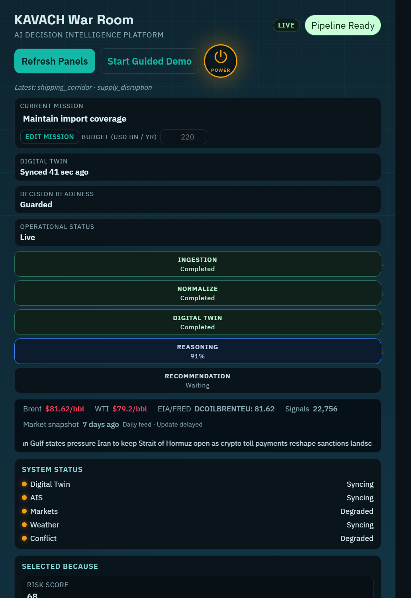
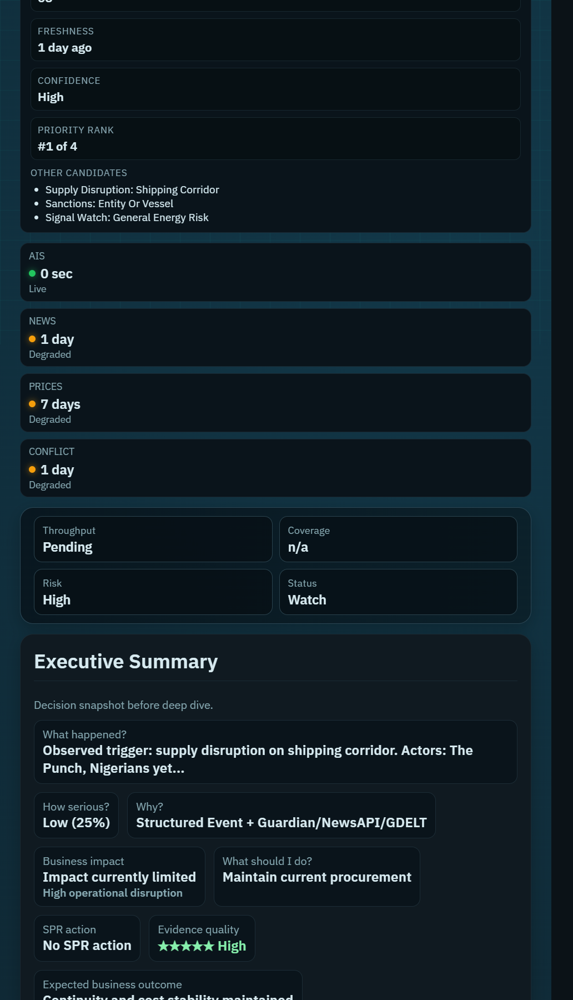
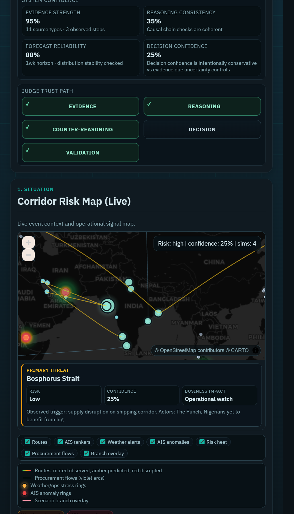

# 🛡️ KAVACH

### AI Decision Intelligence Platform for India's Energy Security

KAVACH continuously monitors geopolitical events, shipping disruptions, market signals, and sanctions to help policymakers make explainable, data-driven decisions for India's crude oil supply chain.

Instead of only showing dashboards, KAVACH answers one question:

> **What should India do next?**

---

## The Problem

India imports more than **85% of its crude oil**.

Geopolitical conflicts, sanctions, shipping disruptions, and market volatility can quickly threaten energy security. Decision-makers must:

- analyze thousands of live signals,
- understand their cascading effects,
- evaluate alternative futures,
- and choose the best operational response.

Today, this process is largely manual, slow, and hard to explain.

---

## Our Solution

KAVACH transforms global uncertainty into operational decisions.

It continuously:

- **Collects** live geopolitical, shipping, weather, and market data
- **Builds** a Digital Twin of India's oil supply chain
- **Generates** explainable hypotheses about what's happening and why
- **Challenges** its own reasoning with a red-team agent
- **Simulates** thousands of possible futures
- **Optimizes** procurement decisions across suppliers
- **Recommends** Strategic Petroleum Reserve drawdown and refill actions
- **Presents** everything in a decision-first executive War Room

Every recommendation carries a plain-language reasoning chain — no black-box outputs.

---

## Architecture

```
External APIs      →   Ingestion   →   Storage
                                          ↓
                                     Digital Twin
                                          ↓
                                     AI Agents
                                          ↓
                                    Decision Engine
                                          ↓
                                       War Room
```

Signals flow left to right. Every AI agent reads from the same Digital Twin, so hypotheses, forecasts, procurement, and policy all speak the same operational truth.

---

## What Makes KAVACH Different

### 🌍 Live Geopolitical Intelligence
Continuously ingests news, shipping, sanctions, weather, and market signals from **11+ live sources** on independent cadences.

---

### 🧠 Digital Twin
Maintains a synchronized operational model of India's crude oil supply chain — countries, ports, chokepoints, tankers, refineries, crude grades, strategic reserves, prices, and sanctions — as one queryable world model.

---

### 🤖 Multi-Agent Reasoning
Every decision passes through an ordered chain of specialized agents:

Hypothesis → Red Team → Scenario → Refinery Impact → Economic → Procurement → Policy

The Red Team argues against the Hypothesis, and the system flags disagreement — so users see doubt, not just confidence.

---

### 🔮 Scenario Simulation
Runs a 10,000-path Monte Carlo forecast over multiple horizons (24 h, 72 h, 1 week, 1 month) to estimate disruption probability, price shock, and duration bands.

---

### 🌐 What-If Engine
Branches the Digital Twin — never the live state — to answer questions like *"What if Hormuz closes?"* or *"What if Saudi output rises?"* in real time.

---

### 🛢 Procurement Optimization
Ranks suppliers using cost, risk, transit time, port status, blend compatibility, insurance exposure, and sanctions. Every rejection carries a reason.

---

### 🏛 Strategic Reserve Intelligence
Every SPR recommendation is complete on four dimensions:

**WHEN · HOW MUCH · FROM WHOM · AT WHAT PRICE**

---

### 📈 Executive War Room
Decision-first interface built for policymakers — the answer comes first, evidence is one click away.

---

## Screenshots

### 1) War Room Top Panel


### 2) Executive Summary + Freshness Panels


### 3) Confidence, Trust Path, and Live Corridor Map


---

## Tech Stack

| Layer | Technology |
|---|---|
| Backend | FastAPI |
| Database | PostgreSQL / SQLite |
| Frontend | Vanilla JS |
| Maps | MapLibre + deck.gl |
| AI | Gemini 2.5 Pro |
| Simulation | NumPy Monte Carlo |
| Scheduler | APScheduler |

---

## Quick Start

```bash
git clone https://github.com/<your-org>/kavach.git
cd kavach

python -m venv .venv
.venv\Scripts\activate            # PowerShell
# source .venv/bin/activate       # macOS / Linux

pip install -r requirements.txt
copy .env.example .env             # add your GEMINI_API_KEY

uvicorn api.main:app --host 127.0.0.1 --port 8001
```

Open **http://127.0.0.1:8001/war-room** in your browser.

The first render bootstraps ingestion, extraction, and one full pipeline run — so the War Room loads with live data, not mocks.

---

## Repository Structure

```
agents/          # Hypothesis, Red Team, Scenario, Refinery, Economic, Procurement, Policy
api/             # FastAPI app, routes, schemas, WebSocket
digital_twin/    # World model of India's oil supply chain
frontend/        # War Room UI
ingestion/       # Live data connectors + scheduler
orchestration/   # Pipeline runner
processing/      # LLM extraction
tests/           # Pytest suite
```

---

## Demo

- Live walkthrough: _add link_
- Slide deck: _add link_
- Full engineering report: [PROJECT_REPORT.md](PROJECT_REPORT.md)

---

## Future Work

- Temporal Knowledge Graph on Neo4j for deeper historical reasoning
- Reinforcement learning for adaptive procurement policy
- Satellite imagery ingestion for port and refinery status
- Multi-country deployment beyond India

---

> **KAVACH is not just an analytics dashboard — it is an AI-powered decision intelligence platform that transforms geopolitical uncertainty into explainable operational decisions for India's energy security.**
